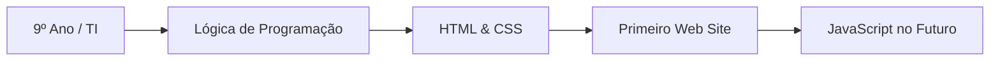

# 🚀 Meu Início no Desenvolvimento Web

## 

💡 Status do Aprendizado
Alertas sobre a minha jornada técnica e o que estou encarando nesse começo de carreira no 1 ano info.

> [!NOTE]
> Estou focado em aprender a estrutura base da web: HTML, CSS e um pouco de lógica.

> [!TIP]
> Qualquer coisa aqui sla.

> [!IMPORTANT]
> O 9º ano é o momento ideal para construir meu portfólio e já sair na frente no Ensino Médio Técnico.

> [!WARNING]
> nao sei nada ainda, mas ainda sei usar o github ahahaha 

> [!CAUTION]
> Ctrl+s

## Clique para ver as tecnologias que estou estudando

Html e Visual studio B)

<details>

<summary>  wow </summary>

### titulo

texto 1

texto 2

```ruby
   puts "Hello World"
```

</details>

### 📊 fluxus

Este é o caminho que desenhei para o meu aprendizado em TI este ano:



## 📍 Onde pretendo chegar

```geojson
{
  "type": "FeatureCollection",
  "features": [
    {
      "type": "Feature",
      "id": "Estudo",
      "properties": {
        "Objetivo": "Meu Lab de Programação"
      },
      "geometry": {
        "type": "Polygon",
        "coordinates": [
          [
            [-45, -20],
            [-45, -25],
            [-40, -25],
            [-40, -20],
            [-45, -20]
          ]
        ]
      }
    }
  ]
}

```
